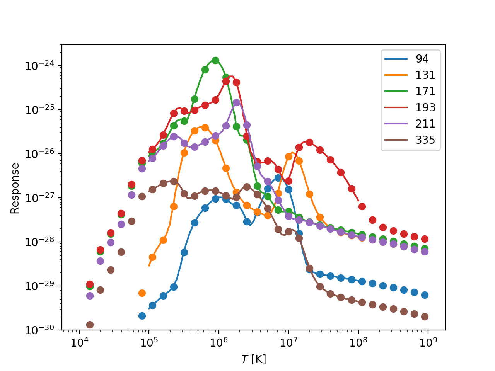

The temperature response functions of the EUV channels of the Atmospheric Imaging Assembly (AIA) are used to understand the temperature of the plasma observed by the different telescopes on the instrument. While these are difficult to calculate, SSW provides a single simple routine to calculate them.

First, import the needed libraries,
```python
import numpy as np
import matplotlib.pyplot as plt
import hissw
```

Next, we need to write the IDL code that will calculate the response functions. Because it is a bit long, we'll put it in a separate file, `calc_aia_response.pro`. Note the Jinja2 syntax (denoted by the `{{}}`) we use to inject our Python variables into the script.
```idl
response = aia_get_response(/{{ flags | join(',/') }})
; Pull needed elements out of structure
logte = response.logte
resp94 = response.a94.tresp
resp131 = response.a131.tresp
resp171 = response.a171.tresp
resp193 = response.a193.tresp
resp211 = response.a211.tresp
resp335 = response.a335.tresp
; Interpolate
interp_logte = {{ interp_logte }}
interp_resp94 = interpol(resp94,logte,interp_logte)
interp_resp131 = interpol(resp131,logte,interp_logte)
interp_resp171 = interpol(resp171,logte,interp_logte)
interp_resp193 = interpol(resp193,logte,interp_logte)
interp_resp211 = interpol(resp211,logte,interp_logte)
interp_resp335 = interpol(resp335,logte,interp_logte)
```

One of the best parts of **hissw** is that we can setup all of our input arguments in Python. Note that arrays have to be formatted as lists.
```python
interp_logte = np.linspace(5, 8, 1000)
flags = ['temp', 'dn', 'timedepend_date', 'evenorm']
inputs = {'flags': flags, 'interp_logt': interp_logte.tolist()}
```

Now create the SSW script environment and run the script. We need to include the SDO/AIA package ([which you'll need to install with SSW if you haven't already](http://www.lmsal.com/solarsoft/)) so that the appropriate files are added to the IDL path.
```python
ssw = hissw.Environment(ssw_packages=['sdo/aia'], ssw_paths=['aia'])
ssw_resp = ssw.run('/path/to/calc_aia_response.pro', args=inputs)
```

Finally, plot the response functions for all 6 EUV channels, showing the original (dots) and interpolated (line) values,
```python
t = 10.**ssw_resp['logte']
interp_t = 10.**interp_logte
for i,channel in enumerate([94,131,171,193,211,335]):
    plt.plot(t, ssw_resp[f'resp{channel}'], 'o', color=f'C{i}', markevery=3)
    plt.plot(interp_t, ssw_resp[f'interp_resp{channel}'], '-', color=f'C{i}', label=f'{channel}')
plt.xlabel(r'$T$ [K]')
plt.ylabel('Response')
plt.xscale('log')
plt.yscale('log')
plt.ylim(1e-30,3e-24)
plt.legend()
plt.show()
```
