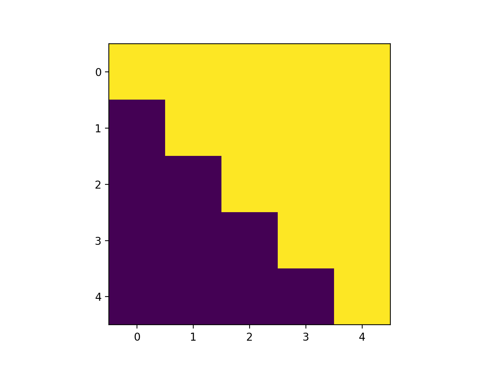

First, let's look at a few plain IDL examples, no SSW needed. In the simplest case, we can return some quantity generated by IDL (no inputs required) and return it to our Python session. This example comes from [Coyote's Guide to IDL Programming](http://www.idlcoyote.com/idl_way/smallexamples.html#EXAMPLE2).

```python
import hissw
import matplotlib.pyplot as plt
script = '''
n = 5
i = REBIN(LINDGEN(n), n, n)           
j = REBIN(TRANSPOSE(LINDGEN(n)), n, n)
mask = (i GE j)
'''
ssw = hissw.ScriptMaker()
results = ssw.run([(script, {})])
plt.imshow(results['mask'])
```

This should generate a plot that looks something like this,


But what if we want to input the size of our upper triangular array with Python? We can use [Jinja templating syntax](http://jinja.pocoo.org/docs/2.10/templates/#synopsis) in our IDL script and then pass in an argument for `n`,

```python
script = '''
n = {{ n }}
i = REBIN(LINDGEN(n), n, n)           
j = REBIN(TRANSPOSE(LINDGEN(n)), n, n)
mask = (i GE j)
'''
ssw = hissw.ScriptMaker()
results = ssw.run([(script, {'n': 100})])
plt.imshow(results['mask'])
```
